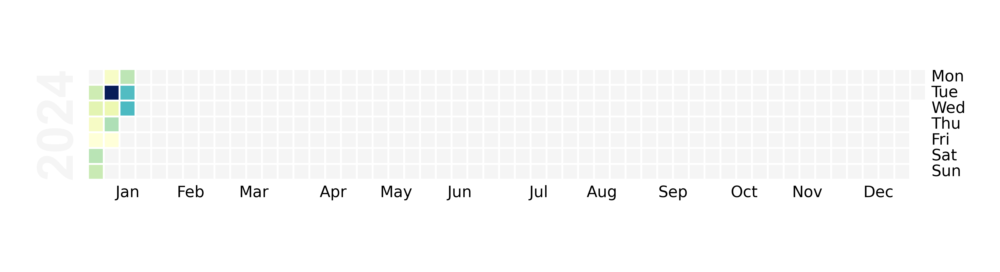

# Heatmap from Garmin data 

`heatmap.py` generates a heatmap of activity locations as a html file `garmin_heatmap.html`, and `garmin_calendar.py` produces a calendar heatmap of activity distances over time as a png file `calendar.png`.

To install required packages, run 

```
pip install pandas gmplot garminconnect matplotlib calmap
```

### Configuration
Export your Garmin connect credentials as environment variables:

```
export EMAIL='your_email@example.com'
export PASSWORD='your_password'
```

### Usage

In both `garmin_calendar.py` and `heatmap.py`, change the `start_date` and `end_date` variables to the desired date range. 


In `heatmap.py`,use your own Google Maps API key in this line:
```
gmap = gmplot.GoogleMapPlotter(combined_df['lat'].mean(), combined_df['lon'].mean(), 13, apikey='your_api_key')
```
### Example

Example of calendar heatmap:



